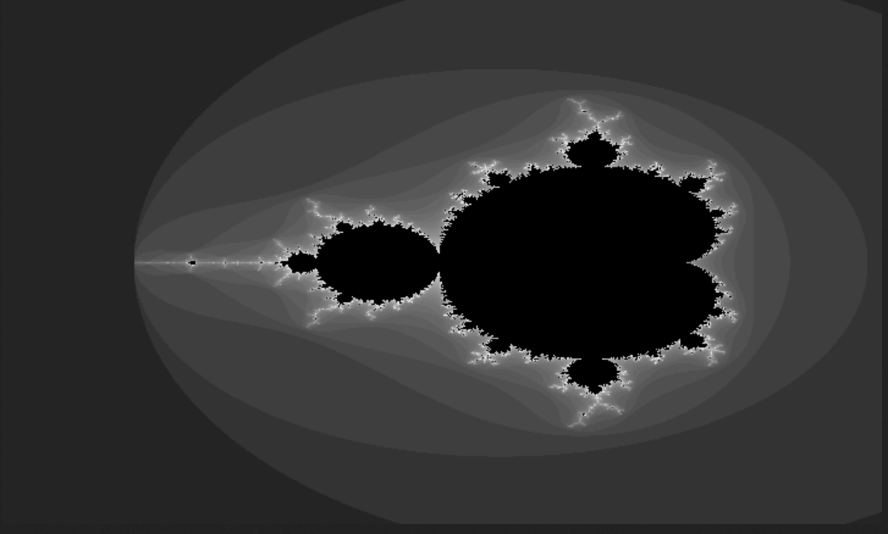

# Stu Fractal Worker

A Cloudflare Worker that generates fractals (Mandelbrot and Julia sets) on demand. The worker creates grayscale images in either BMP or PNG format.



## Features

- Generates Mandelbrot and Julia set fractals
- Supports both BMP and PNG output formats
- Configurable image dimensions
- Adjustable iteration count for detail control
- Seeded random generation for reproducible results

## URL Parameters

- `width`: Image width (default: 720, max: 800 for BMP, 320 for PNG)
- `height`: Image height (default: 432, max: 600 for BMP, 200 for PNG)
- `seed`: Random seed for reproducible generation (default: random)
- `type`: Fractal type ('mandelbrot' or 'julia', default: random)
- `iter`: Number of iterations (default: 50)
- `bmp`: Use BMP format if 'true', PNG if 'false' (default: true)

## Running Locally

To run this project locally, follow these steps:

1. **Install Wrangler CLI** if you haven't already:
   ```bash
   npm install -g wrangler
   ```

2. **Clone the repository** and install dependencies:
   ```bash
   git clone <repository-url>
   cd stu-fractal-worker
   npm install
   ```

3. **Start the development server**:
   ```bash
   wrangler dev
   ```

This will start a local development server, typically at `http://127.0.0.1:8787`. Any changes you make to the code will be automatically reflected.

## Examples

Here are some example requests you can make to the API:

### Generate a Random Mandelbrot Fractal (BMP)

Basic usage (random fractal, BMP format):
http://localhost:8787/

Basic usage (specific size, BMP format, 70 iterations):
http://localhost:8787/?width=720&height=432&seed=1234567890&type=mandelbrot&iter=50

Basic usage (random fractal, PNG format):
http://localhost:8787/?width=300&height=200&seed=1234567890&type=mandelbrot&iter=50&bmp=false


## Limitations
- The BMP format is limited to 800x600 pixels.
- The PNG format is limited to 320x200 pixels.
- The number of iterations is limited to 800.

